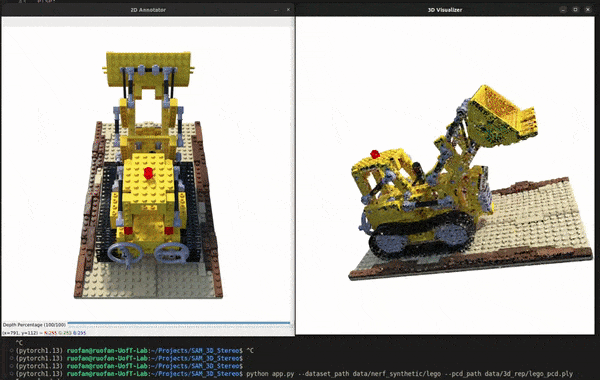
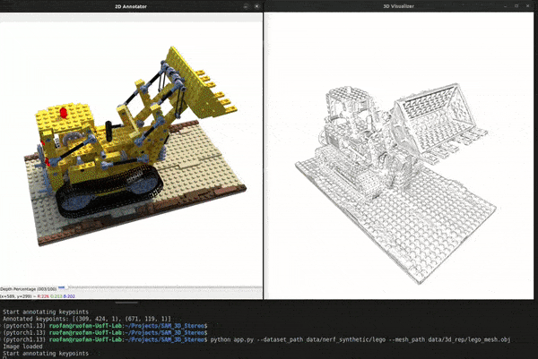

# SAM 3D Selector

This project aims to convert users' multi-view annotated 2D image segmentations (via [segment-anything](https://github.com/facebookresearch/segment-anything)) to the corresponding 3D point cloud/mesh.

Just several coordinate space conversions, no other complicated methods (welcome to leave your suggestions).

I initially implemented this project to help the point selection process for my other project [SPIDR](https://github.com/nexuslrf/SPIDR), where I manually select points for deformations/animations.

I want to use SAM to automate this process, however, my current solution are still far from the perfection.

👇Point cloud



👇Mesh



## Dependencies

* [SAM](https://github.com/facebookresearch/segment-anything)
  * Assume you set up SAM at `./segment-anything` and download checkpoints at `./segment-anything/checkpoints`
  * You can change to other location in `app.py`
* open3d >= 0.16
* python-opencv

## How to Use

Annotate keypoints on the displayed image by clicking with the left mouse button.

Here are some control keys under openCV GUI:

| Key  | Action                                                       |
| ---- | ------------------------------------------------------------ |
| m    | Toggle between foreground and background keypoint annotation |
| z    | Undo the last keypoint                                       |
| s    | Save the mask and keypoints                                  |
| n    | Go to the next frame                                         |
| p    | Go to the previous frame                                    |
| r    | Reset the image                                              |
| c    | Crop the point cloud                                         |
| u    | Union the point cloud                                        |
| x    | Intersect the point cloud                                    |
| e    | Export the masked point cloud (compatible with MeshLab)      |
| q    | Exit the program                                             |
| ~k~ | ~Switch the selection mode~                                 |
| ~a~ | ~Add the current frame mask for multi-frame selection~      |

The slider on the bottom controls the depth of the selected 3D points. The percentage is related to the size of the object bound box.

## Input Arguments

* `--image`: Path to the input image (default: "demo.png").
* `--wo_sam`: Flag to not use the SAM model for mask prediction.
* `--save_path`: Path to save the mask and keypoints (default: "output/").
* `--dataset_path`: Path to a [nerf_synthetic](https://drive.google.com/drive/folders/1JDdLGDruGNXWnM1eqY1FNL9PlStjaKWi?usp=share_link)-like image folder (default: "").
* `--dataset_split`: Dataset split (default: "test").
* `--dataset_skip`: Number of frames to skip in the dataset (default: 10).
* `--pcd_path`: Path to the 3D point cloud file (default: "").
* `--mesh_path`: Path to the 3D mesh file (default: "").

## Example

```bash
python app.py --dataset_path data/nerf_synthetic/lego --pcd_path data/3d_rep/lego_pcd.ply
```

The example point cloud & mesh can be downloaded from the following links:

```bash
# point cloud
gdown --fuzzy https://drive.google.com/file/d/1z9zuTKNbLFp6DOLfJN42kpUO0_ECCvy_/view?usp=share_link -O data/3d_rep/lego_pcd.ply
# mesh
gdown --fuzzy https://drive.google.com/file/d/17rqjWihUJshzt_Hc1YIJ8J5GNfr5WBJf/view?usp=share_link -O data/3d_rep/lego_mesh.obj
```

## Observations

* The SAM's segmentations are amazing, but not perfect. You can often see the boundary are not included in the mask (alot manual-tuning).
* Keypoint prompting's accuracy can be improved a lot with recurrent mask inputs `mask_input=logits`.
* 3D geometry consistency is still too difficult for SAM. We cannot easily wrap the mask to the new frame.
* Automatic combining multi-frame selections is difficult:

  * small components can be easily occluded by other parts: cannot simply union or intersect.
  * intersection on co-visible masks? --> works not well.
